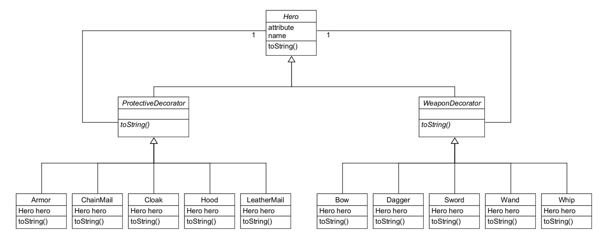
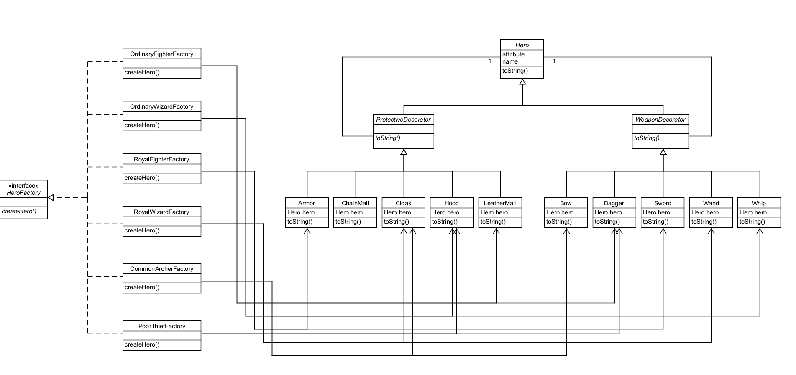
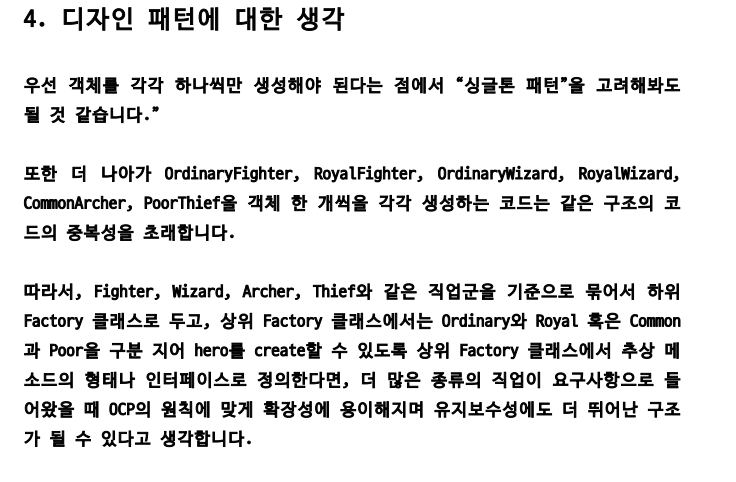

# 기능 구현 목록
게임 캐릭터를 만드는 작업을 하고 있다.
게임 캐릭터는 Hero 객체로표현되며, 전사(fighter), 마법사(wizard), 궁수(archer), 그리고 도적(thief)이 될 수 있다.
무기(Weapon)는 단검(Dagger), 장검(Sword), 활(Bow), 마법지팡이(Wand), 채찍(Whip)가 있다.
방어복(Protective)으로는 망토(Cloak), 가죽옷(LeatherMail), 사슬갑옷(ChainMail), 갑옷(Armor), 후드(Hood)가 있다.
각 캐릭터는 무기와 방어복을 장착할 수 있으며, 무기와 방어복은 각각 하나만 장착할 수 있다.

1. 위 내용을 개발하기 위해 데코레이터 패턴을 적용하려한다. 적절한 클래스 다이어그램을 그려 "보고"문서에 추가 하라.

2. 데코레이터 패턴을 적용하여 위 내용을 구현하라.

3. 게임 캐릭터로 OrdinaryFighter, RoyalFighter, OrdinaryWizard, RoyalWizard, CommonArcher, PoorThief를 제공한다.
   OrdinaryFighter는 Dagger와 LeatherMail를 가지고, RoyalFighter는 Sword와 Armor를 가진다.
   OrdinaryWizard는 Whip와 Hood를, RoyalWizard는 Wand와 Cloak를 가진다.
   CommonArcher는 Bow와 Cloak를 가지며, PoorThief는 Dagger와 Hood를 가진다.
   OrdinaryFighter, RoyalFighter, OrdinaryWizard, RoyalWizard, CommonArcher, PoorThief 생성을 위한
   추상 팩토리 패턴을 적용하려한다. 1에서 만든 클래스 다이어그램을 확장하여 적절한 클래스 다이어그램을 그리고
   "보고"문서에 추가 하라.

4. 추상 팩토리 패턴을 적용하여 위 내용을 구현하라.

5. 위 추상팩토리를 이용하여 OrdinaryFighter, RoyalFighter, OrdinaryWizard, RoyalWizard, CommonArcher, PoorThief
   각각을 위한 객체 한개씩을 각각 생성하는 코드를 작성하라. 이를 위해 적용할 수 있는 패턴이 있을지 생각해 보고,
   자신의 생각을 "보고"문서에 추가하라.

6. 위 코드를 실행하여 결과를 확인한후 모든 파일을 압축하여 제출하라.

# UML

# 추상팩토리 패턴

# 보고

