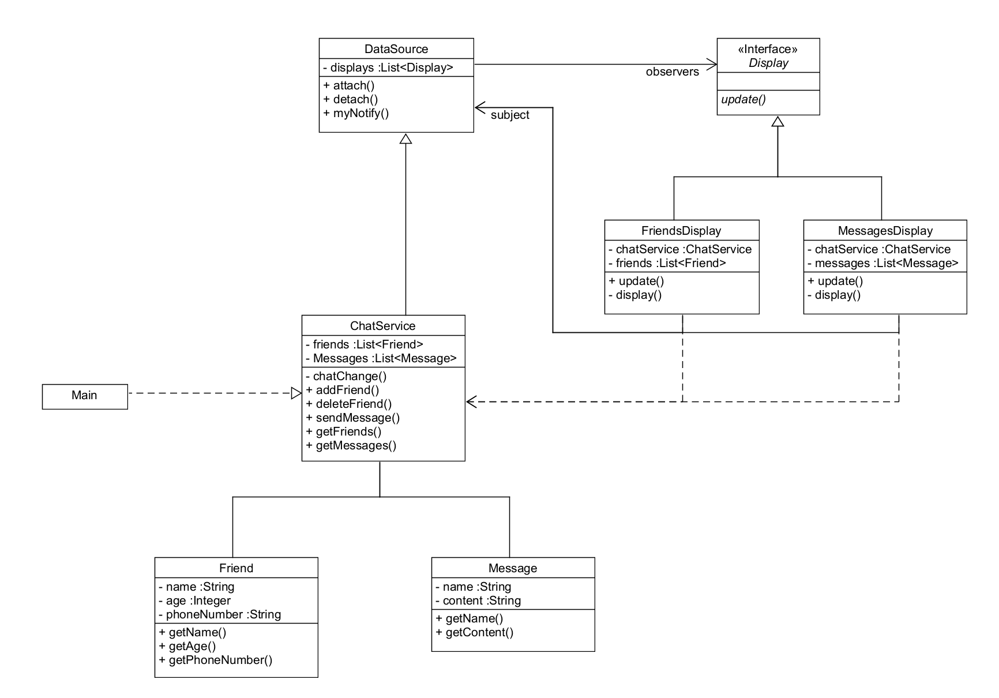

# 📨 채팅 서비스 구현하기
**observer 패턴을 이용한 채팅 서비스 구현하기**

## ✅ UML

## ✅ 기능 구현
- [x] 채팅 메시지를 주고 받을 수 있다
  - 채팅 메시지를 보내면 실시간으로 업데이트 해줘야한다.

- [x] 친구를 추가하고 제거할 수 있다
  - 추가와 제거에는 실시간으로 친구 목록창에서 반영이 된다.

## ✅ 설계

- display
    - update()

- FriendsDisplay
  - update()
  - display()

- MessagesDisplay
  - update()
  - display()

- DataSource
  - List<Display> displays
    - addDisplay()
    - detachDisplay()
    - myNotify()

- ChatService
  - List<message> messages
  - List<Friend> friends
    - chatChange()
    - addFriend(Friend friend)
    - deleteFriend(Friend friend)
    - setMessage(String name, String content)
    - getFriends()
    - getMessages()
   

- Friend

- Message
