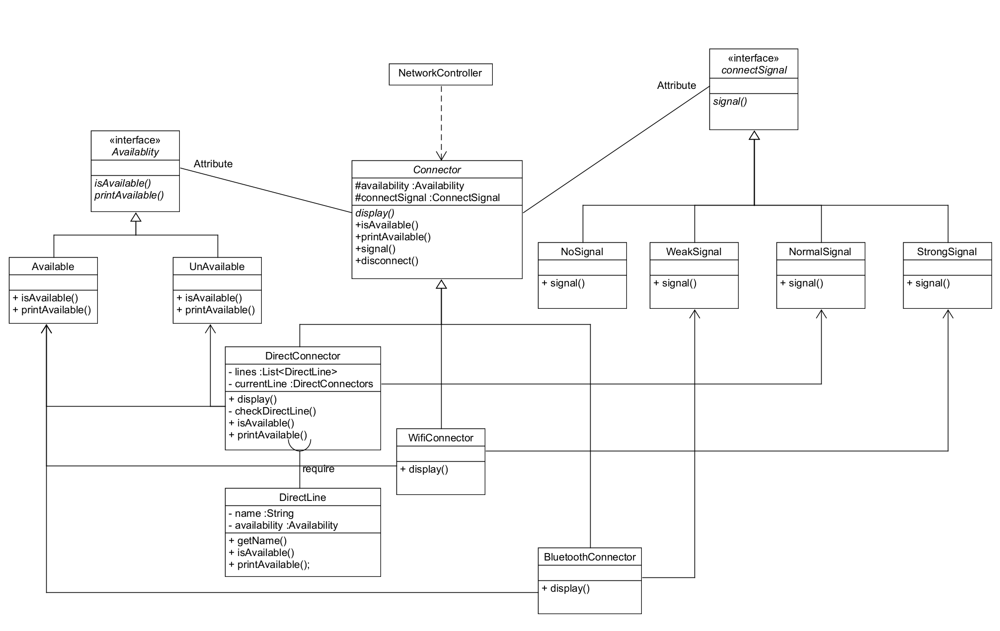

# <DESIGN_PATTERN 과제>

`사용자는 네트워크에 연결하고자 하며, 
연결할 수 있는 방법은 다음과 같이 세 가지가 존재한다.`

1. direct
2. wifi
3. bluetooth
---
## 📌 기능 목록 구현

### 1. 커넥터를 골라서 인터넷에 연결한다.
- [x] 커넥터를 고르는 메시지 출력
- [x] 커넥터를 입력 받은 후 해당 객체에 매핑한다.
  - direct
  - wifi
  - bluetooth

### 2. 각 connector display 출력
- [x] 세 개의 connector에 대해 display를 출력한다.

### 3. 각 connector의 고장 여부 출력
- [x] 각 connector의 고장 여부를 출력한다.

### 4. 각 connector의 신호 상태 출력
  
- [x] directConnector의 신호가 연결이 되지 않는다면 다른 선으로 대체한다.
  - 다른 선은 자동으로 normalSignal에 매핑한다.

- [x] wifi는 항상 강한 신호를 찾아서 연결되기를 원한다.

### 5. 각 connector 연결 해제
- [x] connector의 연결해제를 출력한다.

---
## 📌 추가 요구 사항
-[x] UML로 표현한다.


---
## 📌 코드 설명

### ✅ 상속의 구조를 활용하다
> Connector의 공통적인 특징

Connector의 공통적인 특징은 다음과 같다고 생각했습니다.
1. display (해당 connector가 무엇인지 display)
2. 작동 가능 여부
3. 신호의 세기
4. 연결 해제

따라서 위의 4가지 메서드에 대해서 `Connector`를 부모 클래스로 두어 구현하였습니다.
### ✅ 전략 패턴의 구현

>**OCP의 원칙을 준수하다**

각 connector마다의 특징이 다른 점을 다음 두 가지라고 생각하였습니다.
1. 작동 가능 여부
2. 신호의 세기

따라서 해당의 두 기능을 `connectSignal` 과 `Availability`를 각각 인터페이스로 구성하여
`전략 패턴`으로 구현하였습니다.


### ✅ DirectConnector 확장성 설계

>**확장성을 고려하다**

DirectConnector는 다음과 같은 특징을 지니고 있습니다.
- 첫번째 direct line이 작동하지 않을 경우 두번째 direct line으로 대체한다.

따라서, 처음에는 `FirstDirectLine` 과 `SecondDirectLine` 객체를 설계하여
`DirectConnector`에서 관리하고자 하였습니다.

그러나, 이렇게 설계한 경우에는 만약에 `ThirdDirectLine` 이라는 객체가 새롭게 추가된다면,
또 다시 객체를 구현해야합니다.
객체의 구조는 동일한 형식을 가지고 있어서 `코드의 중복`이 발생합니다.

>**DirectLine**을 설계하다.

따라서 동일한 특징을 가지는 `DirectLine`이라는 객체를 구성하고
`DirectConnector`에서 
```java
private final List<DirectLine> lines = new ArrayList<>();
```
위와 같이 ArrayList로 `DirectLine`을 관리함으로써 추가적인 DirectLine이 들어와도
대응할 수 있도록 **확장성**에 초점을 두어 구현하였습니다.
